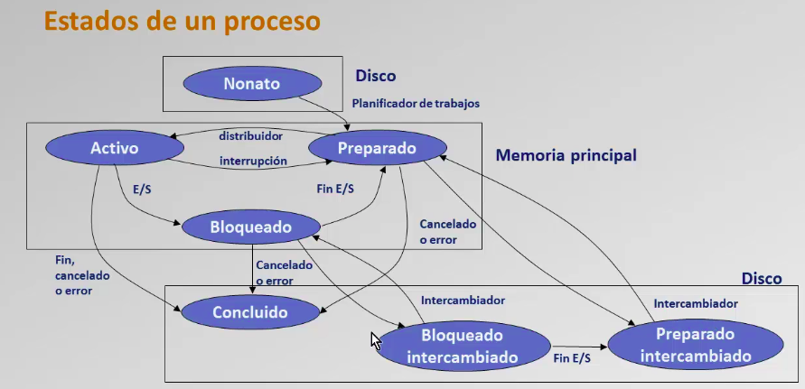

Cuando un proceso está en la RAM es PREPARADO.
Cuando un proceso está en la CPU está en EJECUCIÓN.
Cuando un proceso está en la I/O está BLOQUEADO.
Cuando un proceso no ha entrado ni a RAM o CPU, en el planificador de trabajos es NONATO.
Cuando un proceso ha finalizado está CONCLUIDO.
está en la I/O está BLOQUEADO.

Un proceso es un programa activo.

Un proceso se dice que está en ejecución cuando está en CPU, si no se dice que está preparado.

SO clasificado por ejecución de procesos:
- Monoprgramación: Se ejecuta uno por uno. Espera a que termine el proceso anterior.
- Multiprogramación: Se ejecuta en paralelo.

Tipos de procesamiento:
- Procesamiento interactivo: Responde a las entradas
- Procesamiento por lotes: Se ejecuta un conjunto sin necesidad de esperar entradas externas.

Siempre que se inicia un I/O hace una LLAMADA al SO.
Al finalizar una operación de I/O genera una INTERRUPCIÓN que provoca una LLAMADA al SO

La MONOPROGRAMACIÓN no es EFICIENTE. Porque se desaprovecha recursos, ya que la lectura de disco o I/O tienen tiempos más largos que el de CPU.

En MULTIPROGRAMACIÓN se cargan todos los procesos que entren en la memoria principal, se realiza la ejecución de los procesos después de la llamada al SO en los tiempos que el proceso deja recursos libres debido a llamadas a I/O.

En multiprogramación clásica: 
- Se pasa a ejecutar otro proceso cuando se bloquea el que esté en ejecución (se dice no apropiativo)
- Los procesos usureros se llaman a aquellos que usan muchos recursos cpu ininterrumpido.

En multiprogramación moderna:
- El SO puede interrumpir procesos usureros para ejecutar procesos de mayor preferencia (prioridad)
- Cuando el proceso quede bloqueado como en la multiprogramación clásica.

Gestion de tiempo compartido (turno rotatorio)
A cada proceso se le asigna un QUANTUM de tiempo igual al final del cual se realiza la interrupción, con un modulo planificador a corto plazo (despachador)
